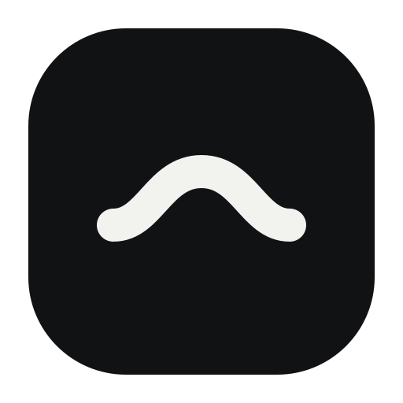

# Neura



Neura — настольный AI-чат для Windows с интерфейсом в стиле Notion.

Приложение позволяет общаться с AI, работать с файлами и использовать подключённые инструменты прямо из одного чата.

## Возможности

- Чат с потоковыми ответами и историей диалогов.
- Переключение между аккаунтами и рабочими пространствами Notion.
- Отображение расхода AI-кредитов и предупреждение об исчерпанном лимите.
- Выбор модели и уровня рассуждений.
- Подключение внешних MCP-серверов.
- Встроенный локальный набор инструментов NotCode:
  - чтение и изменение файлов;
  - поиск по проекту;
  - запуск команд в терминале;
  - работа с Git;
  - создание файлов и артефактов.
- Встроенный ngrok — отдельная установка не требуется.
- Безопасное хранение сессии Notion и ngrok authtoken средствами Windows.
- Просмотр HTML, изображений, текста и исходного кода внутри приложения.
- Скачивание созданных AI файлов.
- Интерактивные вопросы и опросы от AI.
- Светлая и тёмная темы.

## Первый запуск

1. Запустите Neura.
2. Подключите аккаунт Notion в разделе **Настройки → Аккаунт**.
3. При необходимости укажите личный ngrok authtoken в разделе **Подключённые инструменты**.
4. Выберите рабочее пространство и начните новый чат.

## Требования

- Windows 10 или Windows 11.
- Подключение к интернету.
- Аккаунт Notion с доступом к Notion AI.

## Разработка

```powershell
wails dev
```

## Сборка

```powershell
wails build
```

Готовое приложение появится в `build/bin`.
