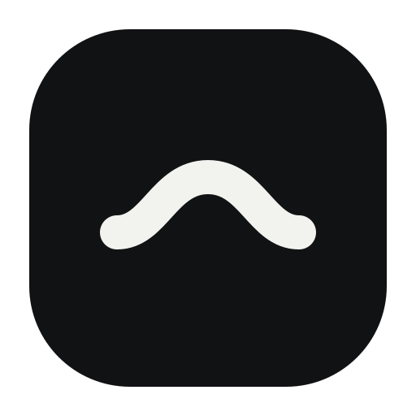

# Neura



Neura — настольный AI-чат для Windows с интерфейсом в стиле Notion.

Приложение позволяет общаться с AI, работать с файлами и использовать подключённые инструменты прямо из одного чата.

## Возможности

- Чат с потоковыми ответами и историей диалогов.
- Переключение между аккаунтами и рабочими пространствами Notion.
- Отображение расхода AI-кредитов и предупреждение об исчерпанном лимите.
- Выбор модели и уровня рассуждений.
- Подключение внешних MCP-серверов.
- Встроенный локальный набор инструментов NotCode:
  - чтение и изменение файлов;
  - поиск по проекту;
  - запуск команд в терминале;
  - работа с Git;
  - создание файлов и артефактов.
- Встроенный ngrok — отдельная установка не требуется.
- Безопасное хранение сессии Notion и ngrok authtoken средствами Windows.
- Просмотр HTML, изображений, текста и исходного кода внутри приложения.
- Скачивание созданных AI файлов.
- Интерактивные вопросы и опросы от AI.
- Светлая и тёмная темы.

## Первый запуск

1. Запустите Neura.
2. Подключите аккаунт Notion в разделе **Настройки → Аккаунт**.
3. При необходимости укажите личный ngrok authtoken в разделе **Подключённые инструменты**.
4. Выберите рабочее пространство и начните новый чат.

## Протоколы Notion AI

Neura не смешивает чаты разных wire-протоколов:

- **Legacy** — старый workflow через `runInferenceTranscript` со старым config.
- **Beta V2** — агентный workflow через `runInferenceTranscript`: NDJSON stream,
  computer/MCP/surveys/skills/memories и предварительное сохранение каждого
  продолжения через `saveTransactionsFanout`.
- **Beta V3** — отдельный Agent Service: `createAgentThread`,
  `sendEventToAgentThread`, `getThreadTranscript`.

Один и тот же локальный чат получает отдельную remote-thread привязку для
каждого режима, поэтому переключение протокола не продолжает несовместимый тред.

## Авторизация и секреты

### Notion

Отдельный integration token или API key не нужен. Neura воспроизводит
browser-сессию текущего пользователя:

1. Откройте Notion в браузере под нужным аккаунтом и workspace.
2. Откройте DevTools → Network и отправьте тестовое сообщение Notion AI.
3. Для Legacy/Beta V2 найдите `runInferenceTranscript`; для Beta V3 —
   `createAgentThread`.
4. Выберите **Copy as cURL** и импортируйте команду в настройках Neura.

Из cURL приложение автоматически берёт `Cookie`,
`x-notion-active-user-header`, `x-notion-space-id`, `notion-client-version`,
cell hint, Origin и Referer. Не копируйте отдельные cookie вручную и никогда не
передавайте cURL другим людям: он даёт доступ к вашей browser-сессии.

Сессии Notion сохраняются через Windows DPAPI и расшифровываются только тем же
Windows-пользователем. При истечении cookie нужно импортировать свежий cURL.

### ngrok

Для встроенного локального MCP нужен **ngrok authtoken** из личного кабинета
ngrok: Dashboard → Getting Started / Your Authtoken. Это не URL туннеля и не
Notion token. Токен сохраняется через Windows DPAPI.

### Внешние MCP-серверы

Ключ выдаёт сам провайдер MCP. В зависимости от его документации он передаётся:

- как Bearer token;
- в произвольном заголовке (`X-API-Key` и т.п.);
- в query-параметре (`api_key`, `profile`);
- для stdio-сервера — в переменной окружения процесса.

Настройки и секреты MCP хранятся в защищённом `settings.dpapi`. Старый
plaintext `settings.json` автоматически мигрируется и удаляется после первого
успешного сохранения.

## Требования

- Windows 10 или Windows 11.
- Подключение к интернету.
- Аккаунт Notion с доступом к Notion AI.

## Разработка

```powershell
wails dev
```

## Сборка

```powershell
wails build
```

Готовое приложение появится в `build/bin`.
